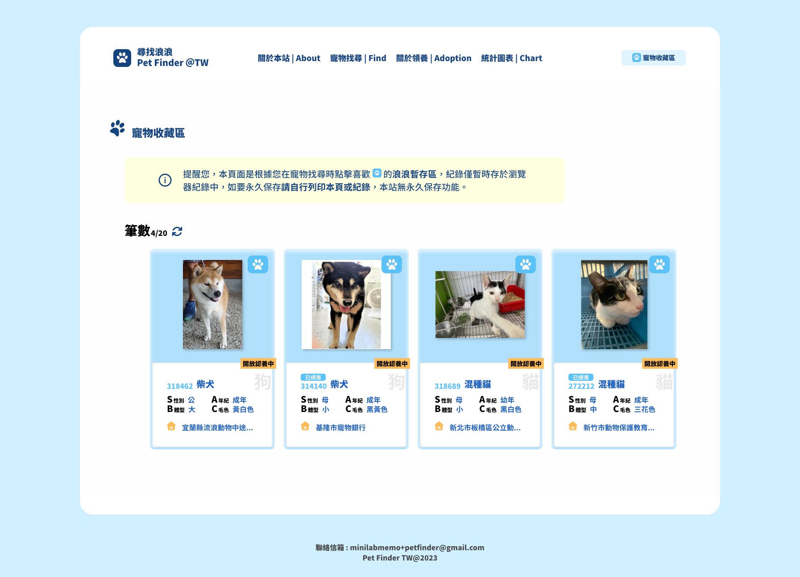
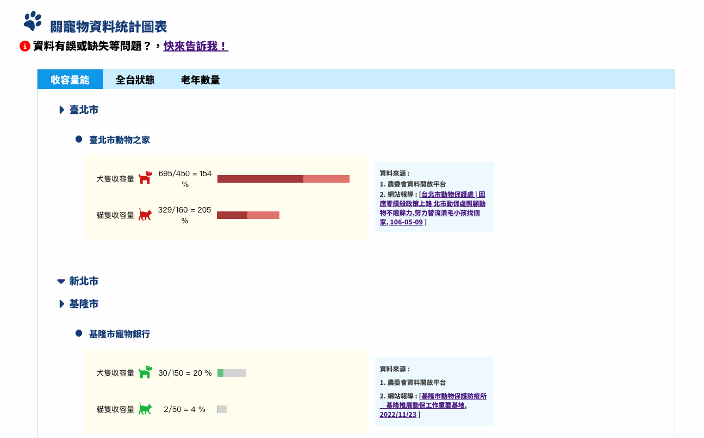

# pet-finder-tw
台灣收容中心動物開放資料搜尋。

- [Git README](https://github.com/minilabmemo/pet-finder-tw/blob/master/README.md) 
- website: https://minilabmemo.github.io/pet-finder-tw/

### features

- 動物搜尋
  - 目前搜尋條件：地區/種類/性別/關鍵字。
  - 搜尋完成後點擊寵物卡片可以進一步看所有收容詳細資料。
  - 搜尋完成後看到喜歡的寵物可以點擊收藏，暫時先收入寵物收藏區。

- 動物收藏
根據寵物找尋時點擊喜歡的浪浪暫存區，紀錄僅暫時存於瀏覽器紀錄中，本網站無永久保存功能。

- 動物統計
  - 各縣市收容量
  - 各縣市貓狗年齡（幼老）比

